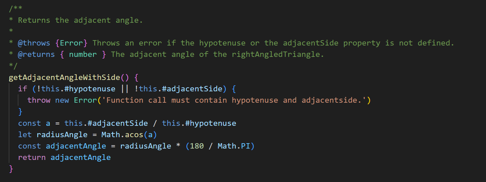
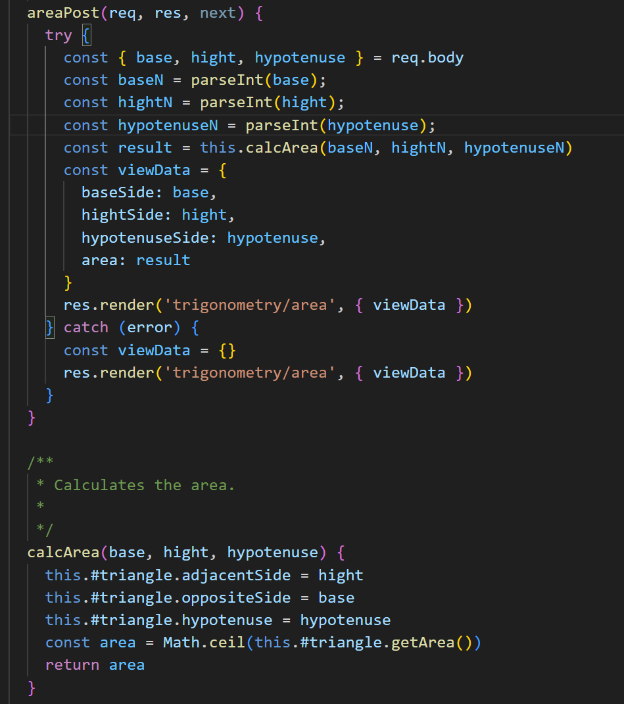
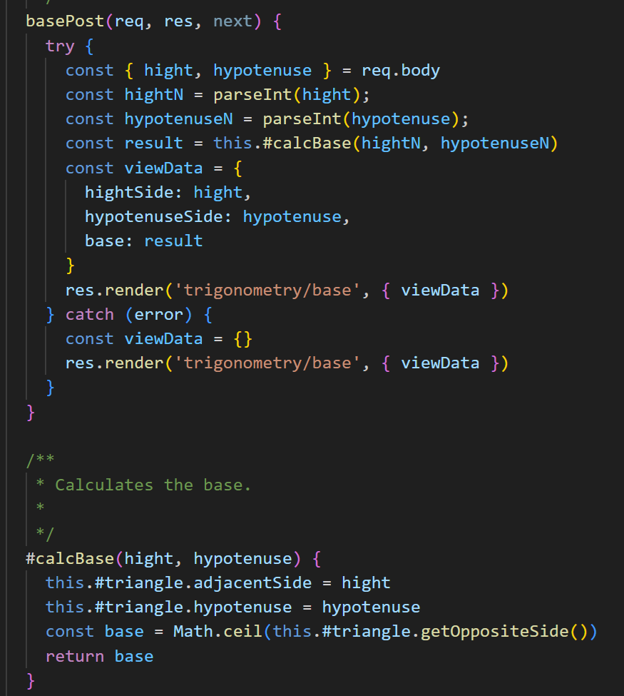
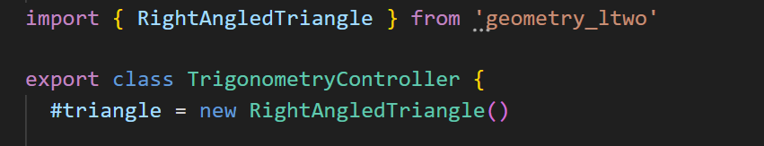
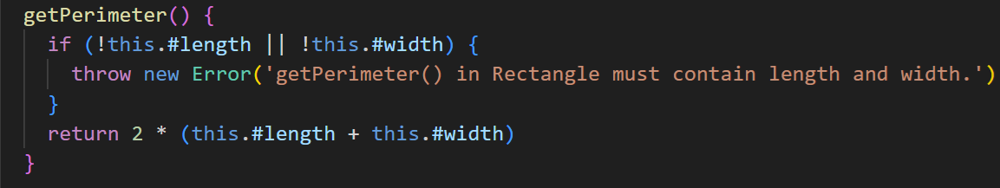
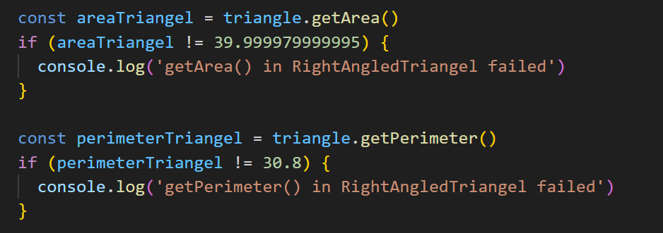
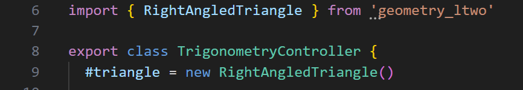
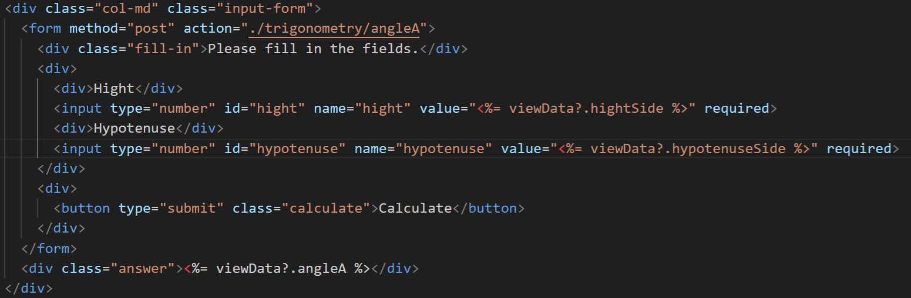

# Reflektioner
## Meaningful Names (Chapter 2)
Tycker fortfarande att det är svårt med namngivning. Har försökt ta till mig feedbacken jag fick på min codereview att jag hade för krångliga och långa namn. Jag höll med om detta och har kortat ner mina namn. Jag hade gått helt efter bokens filosofi att ha beskrivande namn gärna så bra att du inte behöver beskrivande kommentarer. Nu när de är kortare så förstår man inte vad funktionen gör bara genom att läsa namnet. Man måste antigen läsa dokumentationen, se funktionen eller läsa kommentarer. Jag håller med om att det gör koden mer lättläst men jag kan inte bestämma mig vilket som följer boken bäst. Det är en svår avvägning av när namn är för långa.

## Functions (Chapter 3)
Jag förstår det som att det här är själva essensen av clean code. Skriv små funktioner som gör en sak. Detta har jag försökt att följa och jag tycker att jag har lyckats ganska bra. Nu är ju min modul en väldigt enkel modul utan någon stor komplexitet med många små uträkningar hela tiden. Så det har inte varit så svårt att skriva små funktioner. Har även försökt att bryta ut funktioner där det går som t.ex i exemplet under. Där calcArea() är en egen funktion.

## Comments (Chapter 4)
Kommentarer är en svår avvägning, själv skulle jag inte behöva några kommentarer alls. Eftersom jag förstår allt jag skrivit och tycker jag följer en röd tråd. Men om jag kommer tillbaka om några månader och läser min kod så kommer det gå mycket snabbare att förstå hur jag har tänkt om det finns kommentarer. Enligt boken ska man bara ha de nödvändiga kommentarerna och det har jag försökt ta till mig. När jag nu har kortat ner mina namn så tycker jag kommentarerna blir ännu värdefullare som t.ex nedan, då man i throws kan läsa vilka properties som behövs. Det kunde man innan förstå i funktionsnamnet.

## Formatting (Chapter 5)
Jag håller med boken i den här delen, tycker den beskriver det rätta sättet att skriva klasser på. Att först kommer ett klass-namn som beskriver vad klassen gör sedan kommer medlemsvariablar sedan funktioner. Och att funktioner som används av andra funktioner ska ligga nära funktionen där den används. Som t.ex calcBase() som ligger precis under funktionen där den används. Gillar också att allt byggs upp på samma sätt hela tiden, då blir koden mycket lättare att läsa och förstå.

## Objects and Data Structures (Chapter 6)
Det här var ett svårt kapitel. Men som jag förstår det så handlar det mycket hur man ska jobba med objekt orientering på bästa sätt. Och en viktig del är The Law of Demeter...talk to friends not to strangers. Jag förstår det som att när jag gör ett nytt triangel objekt som min medlemsvariabel så går det bra att anropa funktioner på den. Men om jag någonstans skulle anropa en typ getTriangel() i min klass och få ett till triangelobjekt så skulle jag inte få anropa metoder på det objektet.

## Error Handling (Chapter 7)
Boken gillar att man kastar fel som sedan fångas och det gör jag också. Tycker det blir klar och lättläst kod när fel kastas. Håller också med om att det är viktigt med bra felmeddelande. Man ska tänka att det är någon annan än jag som ska läsa dem. Särskilt i min modul som är byggd för att andra ska kunna använda den. Däför har jag ändrat meddelandena så de berättar i vilken funktion de kastas.

## Boundaries (Chapter 8)
Också ett svårt kapitel att ta till sig. Men jag förstår det som att det handlar om när man använder 3:dje parts kod. Alltså som t.ex ett npm packet, där du inte vet hur den är skriven. Den ligger utanför dina gränser. I just det här fallet är det ju jag som har skrivit den koden också så jag vet precis hur den fungerar. Men om jag inte hade gjort det så är det smart att skriva tester så att man lär sig hur den fungerar, detta kostar inget och din egna kod blir robustare om du vet vad som kan gå fel i annans kod. Man ska också minimera punkterans där de används. Här finns en testApp.js som testar modulens kod och det är så jag tänker man kan göra om man använder 3:dje parts kod.

## Unit Tests (Chapter 9)
Boken förespråkar verkligen att skriva tester först samt att hålla dem uppdaterade(rena), "If you let the test rot, then your code will rot too. Keep your tests clean." Förstår att detta håller koden buggfri och lättare att underhålla men det är inte en praxis jag har följt. Men det har mer med att göra att jag saknar kunskap (och tid). Ser fram emot nästa kurs där jag ska få lära mig mer om mjukvarutestning. Jag har skrivit semiautomatieserade tester för modulen som kan ses i exemplet ovan. Men för själva appen finns endast manuella tester som kan ses i [Kravspecifikationen](/Kravspecifikation.md)

## Classes (Chapter 10)
Det här kapitlet tycker jag flyter ihop lite med Chapter 5 Formatting i om hur man bygger upp klasser och där håller jag med boken. Det som det här kapitler tar upp lite mer om är att den tycker att klasser ska vara små och att klasser ska ha ett ansvarsområde. Detta har jag tampats med fram och tillbaka. Om man kollar på min trigonometryController så kan man ju se att den har ansvar för att räkna ut basen, höjden, hypotenusan osv. Då skulle man i så fall vilja dela upp den i flera små klasser. Men då tycker jag att min kod skulle bli svårläst och inte följa clean code. Därför har jag valt att tänka att dess ansvarsområde är trigonometri och då kan jag enkelt skala upp applikationen om jag vill. Jag kan t.ex enkelt lägga till en rectangleController och en circleController om jag skulle vilja och då även behålla en ren struktur i min app. 

## Systems (Chapter 11)
Också svårt kapitel att ta till sig. Men jag tror det handlar om att man ska skriva enkel clean code som är enkel att skala upp iterativt och incrementellt. Man kan inte få det rätt första gången utan det krävs en utvecklingsprocess och har man gjort rätt från början men objektorienterat, test first och följt alla andra regler i boken så ska det vara lätt. Även att jag vet att jag har många punkter där jag inte följer clean code medvetet eller omedvetet så är min kod iallafall enkel och går väldigt lätt att skala upp. Jag är medveten om att jag har ett strängberoende i mina vyer men jag har valt att ha kvar det så för att jag använder express.js och de gör så.
