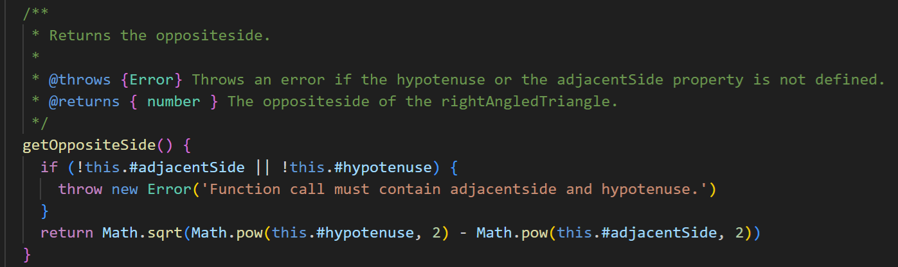

# Reflektioner
## Meaningful Names (Chapter 2)
Tycker fortfarande att det är svårt med namngivning. Har försökt ta till mig feedbacken jag fick på min codereview att jag hade för krångliga och långa namn. Jag höll med om detta och har kortat ner mina namn. Jag hade gått helt efter bokens ha beskrivande namn gärna så bra att du inte behöver beskrivande kommentarer. Nu förstår man inte vad funktionen gör bara genom att läsa namnet. Man måste antigen läsa dokumentationen, se funktionen eller läsa kommentarer. Men det gör koden lättläsare. Så jag har fortfarande inte bestämt vilket jag tycker är bäst.

## Functions (Chapter 3)
Jag förstår det som att det här är själva essensen av clean code. Skriv små funktioner som gör en sak. Detta har jag försökt att följa och jag tycker att jag har lyckats ganska bra. Nu är ju min modul en väldigt enkel modul utan någon stor komplexitet med små uträkningar hela tiden. Så det har inte varit så svårt att skriva små funktioner. Har även försökt att bryta ut funktioner där det går som t.ex i exemplet under. Där calcArea() är en egen funktion.

## Comments (Chapter 4)
Kommentarer är en svår avvägning, själv skulle jag inte behöva några kommentarer alls. Eftersom jag förstår allt jag skrivit och tycker jag följer en röd tråd. Men om jag kommer tillbaka om några månader och läser min kod så kommer det gå mycket snabbare att förstå hur jag har tänkt om det finns kommentarer. Enligt boken ska man bara ha de nödvändiga kommentarerna och det har jag försökt ta till mig. När jag nu har kortat ner mina namn så tycker jag kommentarerna blir ännu värdefullare som t.ex nedan, då man i throws kan läsa vilka properties som behövs.

## Formatting (Chapter 5)
Jag håller med boken i den här delen, tycker den beskriver det rätta sättet att skriva klasser på. Att först kommer ett klass-namn som beskriver vad klassen gör sedan kommer medlemsvariablar sedan funktioner. Och att funktioner och lokala variablar ska ligga nära där de används. Som t.ex calcBase() som ligger precis under funktionen där den används. Gillar också att allt byggs upp på samma sätt hela tiden, då blir koden mycket lättare att läsa och förstå.

## Objects and Data Structures (Chapter 6)
Det här var ett svårt kapitel. Men som jag förstår det så handlar det mycket hur man ska jobba med objekt orientering på bästa sätt. Och en viktig del är The Law of Demeter...talk to friends not to strangers. Jag förstår det som att när jag gör ett nytt triangel objekt som min medlemsvariabel så går det bra att anropa funktioner på den. Men om jag någonstans skulle anropa en typ getTriangel() i min klass och få ett till triangelobjekt så skulle jag inte få anropa metoder på det objektet.
